# 開発環境構築手順

本ドキュメントでは、DevContainer を用いた React + Bun 開発環境の構築手順について記載します。
本手順では、既存のリポジトリをクローンするのではなく、新規にアプリケーションを作成する流れを解説します。

## 1. 前提条件

以下のソフトウェアがインストールされていることを確認してください。

*   [Docker Desktop](https://www.docker.com/products/docker-desktop/)
*   [Visual Studio Code](https://code.visualstudio.com/)
*   [Dev Containers (VS Code Extension)](https://marketplace.visualstudio.com/items?itemName=ms-vscode-remote.remote-containers)

## 2. 構築手順

### ステップ 1: プロジェクトフォルダの準備

VS Code で空のプロジェクトフォルダを開きます。

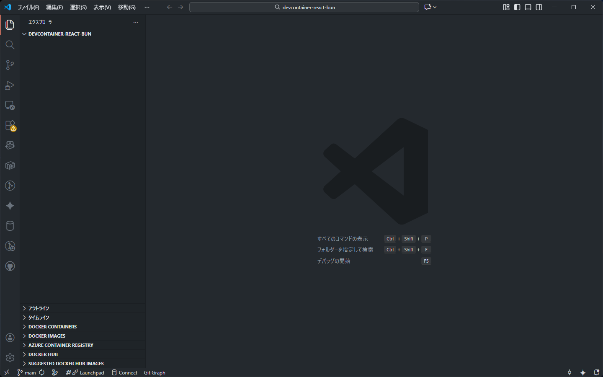

### ステップ 2: Dev Container 設定の追加

コマンドパレット (`F1` または `Ctrl+Shift+P`) を開き、**Dev Containers: Add Dev Container Configuration Files...** を選択します。

 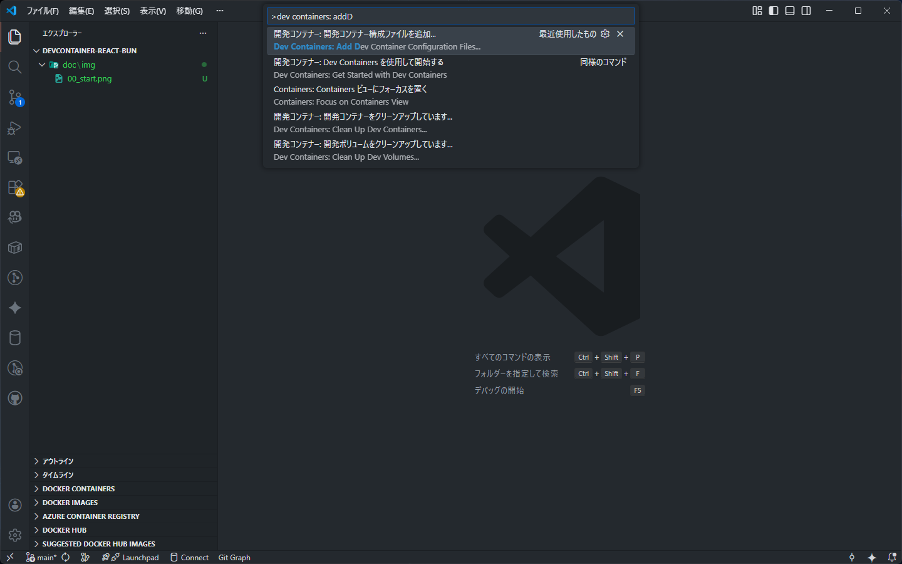 

ワークスペースに設定を追加します。

 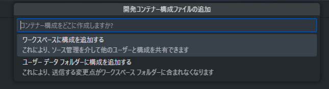 

### ステップ 3: コンテナイメージの選択

ベースとなるイメージ定義を選択します。ここでは **Bun** を検索して選択します。

 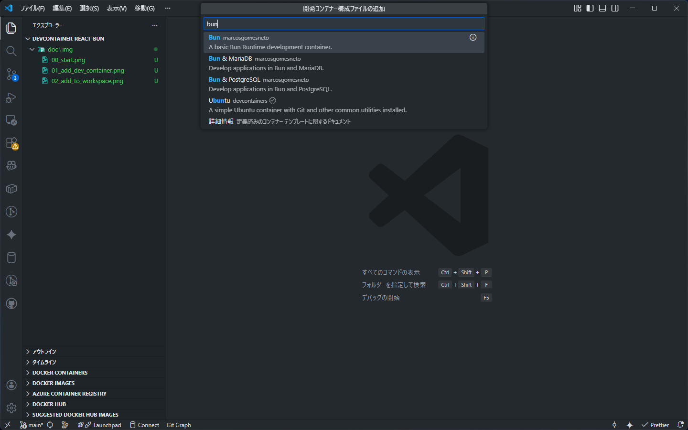 

Bun のイメージ のバージョンを選択します（例: `debian` や `alpine` など）。

 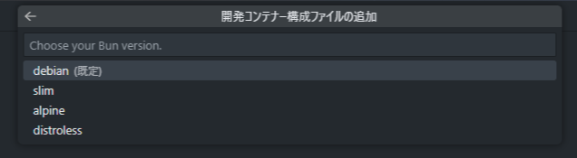 

### ステップ 4: 機能 (Features) の追加

コンテナに追加インストールするツール（Features）を選択します。

 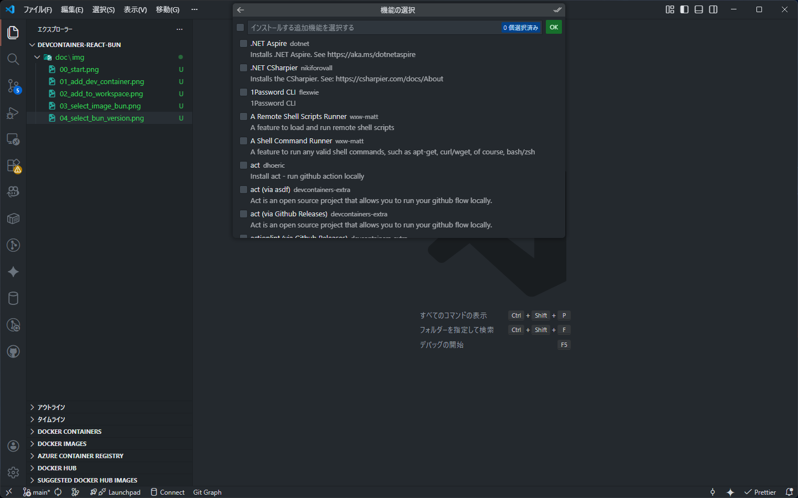 

Git などを選択し、OK を押します。（任意）

 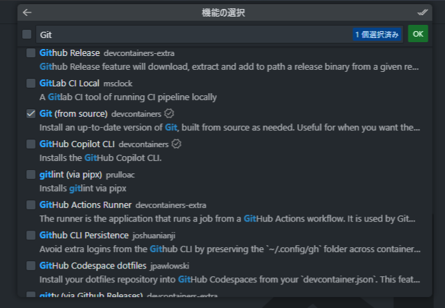 

設定を確定します。

 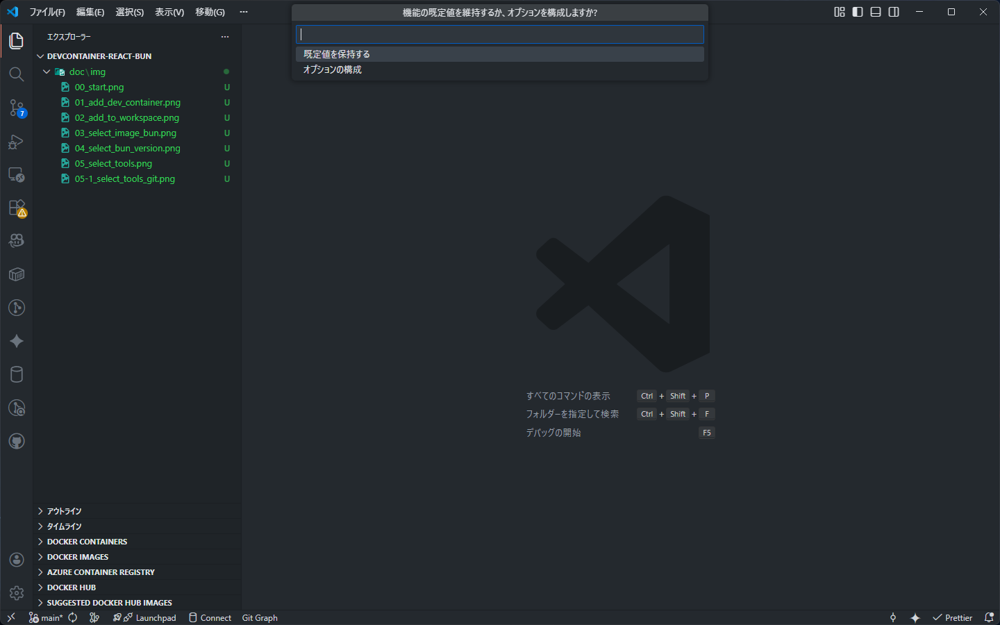 

`.devcontainer` フォルダと `devcontainer.json` が生成されます。

 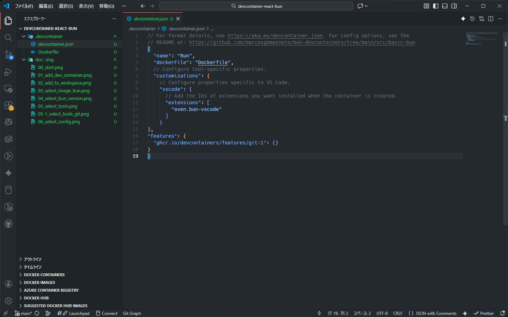 

### ステップ 5: コンテナで開く

右下の通知やコマンドパレットから **Dev Containers: Reopen in Container** を実行し、コンテナをビルド・起動します。

 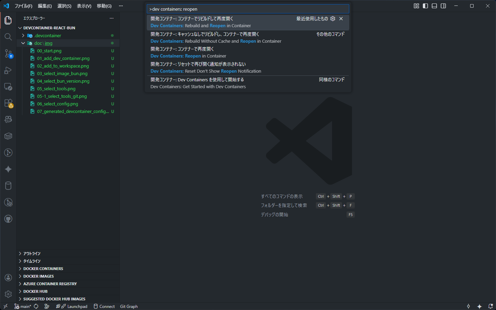 

起動が完了すると、VS Code 左下のステータスバーに接続状態が表示されます。

 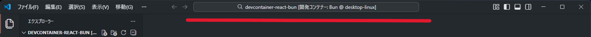 

### ステップ 6: React アプリの作成 (Vite)

コンテナ内のターミナルで以下のコマンドを実行し、Vite を使用して React アプリを作成します。

```bash
bun create vite
```

最後の質問で `Install with bun and start now?` の質問に `Yes` を回答すると、Bunによるインストールと起動が同時に実行されます。しかし、この時点ではアプリが動かせないと思うので、インストール完了後に `Ctrl + C` で停止します。 

 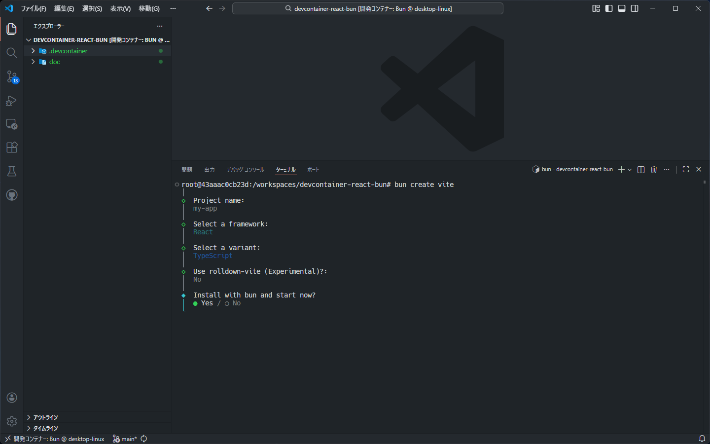 

### ステップ 7: 設定の調整

必要に応じて `package.json` の `scripts` を編集します（例: ホストからのアクセスを許可するために `--host` オプションを追加するなど）。

```json
{
  ...
  "scripts": {
    "dev": "vite --host", // ← `--host` を追加
    "build": "tsc -b && vite build",
    "lint": "eslint .",
    "preview": "vite preview"
  },
  ...
}
```

### ステップ 8: 依存関係のインストールと起動

作成したプロジェクトフォルダに移動し、依存関係をインストールしてから開発サーバーを起動します。

```bash
cd my-app
bun run dev
```

 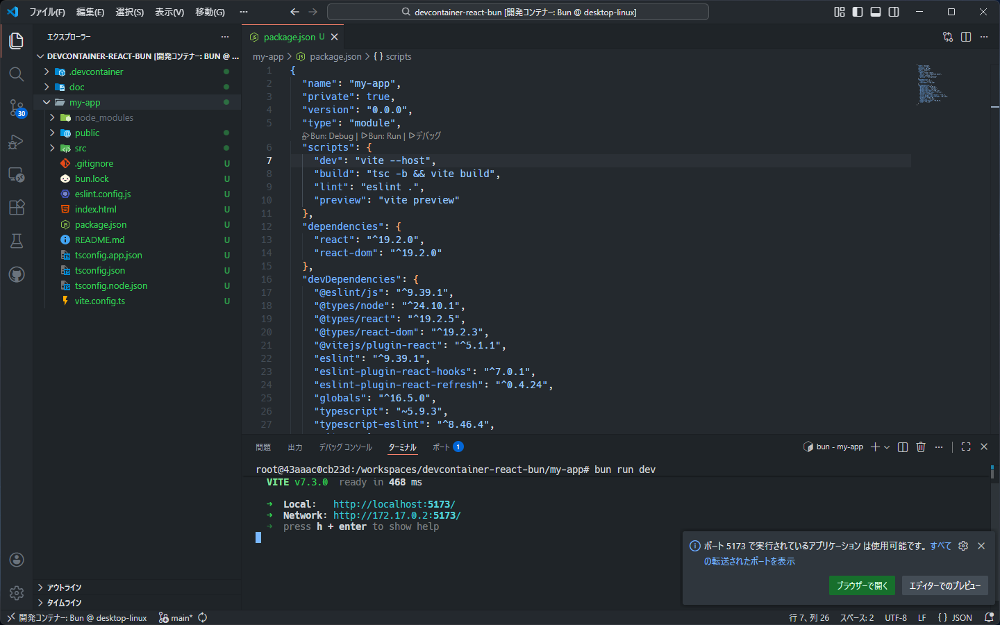 

> Tips: 今後、ディレクトリを移動しなくてもいいように、 `my-app` 内のすべてのファイルをプロジェクト直下に移動するか、 Dev Container 起動時の WORKDIR を `my-app` にするとよい。

### ステップ 9: 動作確認

ブラウザでローカルサーバー（例: `http://localhost:5173`）にアクセスし、React アプリが表示されることを確認します。

 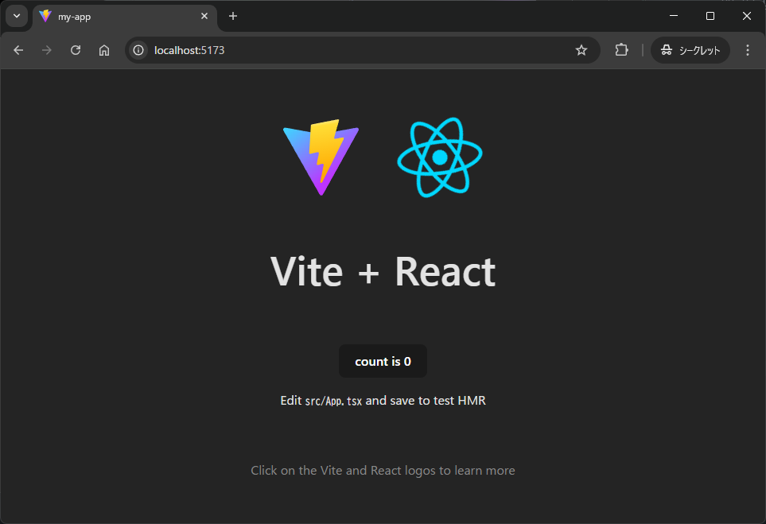

また、 `/my-app/src/App.tsx` を修正すると、自動反映されます。